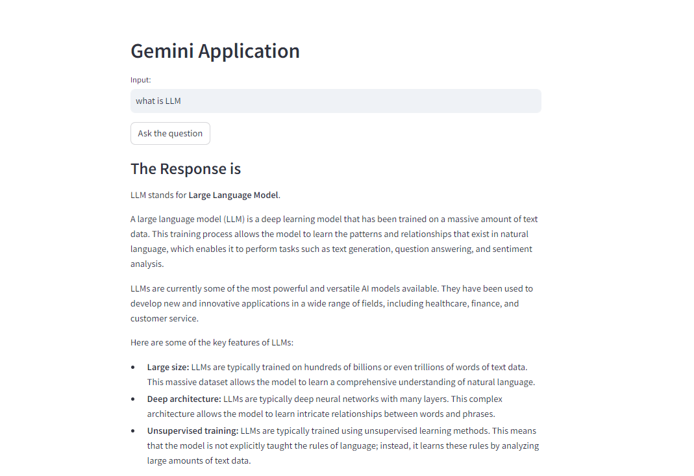

# Conversational-QA-Chatbot-GeminiPro
Building a Smart and Engaging Q&amp;A Chatbot with Gemini Pro

---
This project aims to create a conversational chatbot that can hold informative and open-ended dialogues, answering your questions in a comprehensive and engaging way.

### Key technologies:

- Gemini Pro: Google AI's powerful large language model, providing advanced text generation and comprehension capabilities.
- genai.GenerativeModel('gemini-pro'): Python library for interacting with and leveraging Gemini Pro within your chatbot.

## Output:

